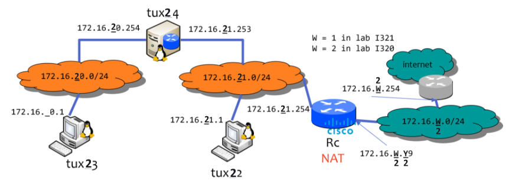

# FEUP-RCOM project 2

**Description** - FTP Application + Network Configuration to transfer data from the web and exchange files between computers in a local network

**Course** - Computer Networks

## Project Overview

This project is divided into two parts:
#### FTP Application
The FTP (File Transfer Protocol application, a program that can with TCP connections, using sockets, transfer files stored in FTP servers, using the link syntax:
<br/>
>```ftp://[<user>:<password>@]<host>/<url-path>```
<br/>

The code for this application can be found in the [./src](./src/) folder.


#### Network Configuration
To use the application, it was requested to incrementally configure a network of 3 computers, a Switch, and a Cisco Router, represented in the following scheme:



This was done by creating Bash scripts that configured computer IPs, DNS Services, VLANs, switchports, and by correctly connecting the computers, Switch and Router with cables.

The final Bash scripts and the ones used in each lab can be found in the [Config_Commands.md](./Config_commands.md) file.

### Group:
- Ana Barra - up20194795
- Sérgio Estêvão - up201905680
- Sérgio da Gama - up201906690


